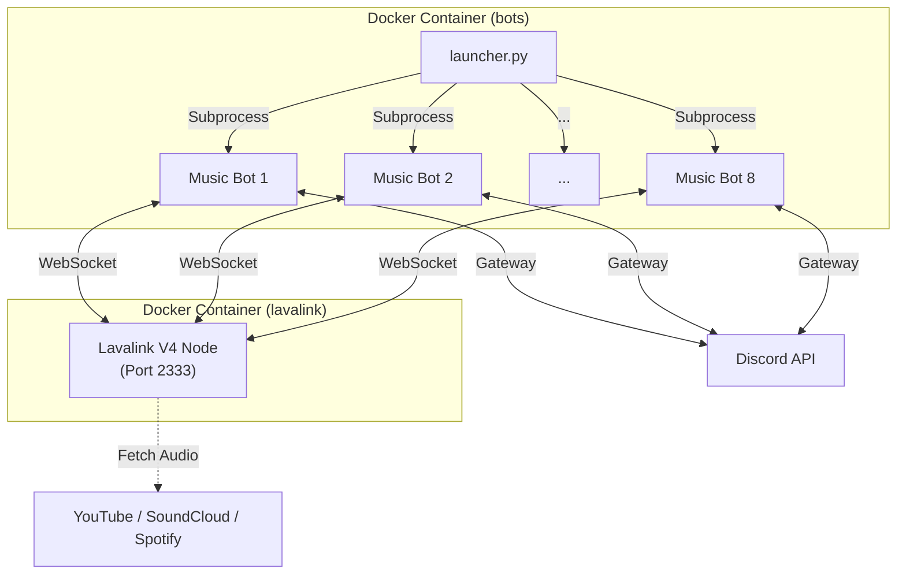

<div align="center">
  
</div>

<div align="center">
  <p><strong>A highly scalable, multi-instance Discord Music Bot multiplexer powered by Python & Lavalink V4.</strong></p>
  
  [](https://www.python.org/)
  [](https://lavalink.dev/)
  [](https://github.com/Rapptz/discord.py)
  [](https://www.docker.com/)
  [](LICENSE)
</div>

## 🌟 Overview

**Multi-Music Discord Bots** is capable of running **multiple Discord Music Bots (up to 9) simultaneously** out of a single codebase, mapped to a unified Lavalink V4 Node. 

Tired of deploying separate containers and repositories for every new bot you want to run? Our robust python `launcher.py` spins up all your bots concurrently inside a single environment under isolated memory pools, ensuring they never clash or face "Singleton Wavelink Pool" overlaps.

## ✨ Key Features

- **🚀 Multiplexer Engine:** Run up to 9 individual music bots directly from `launcher.py` using Subprocesses. Every bot is isolated visually but shares one codebase.
- **🎵 Lavalink V4 Integration:** Built specifically for the latest wavelink and Lavalink features, offering lag-free enterprise audio.
- **🔥 Anti-Hijack & Strict Isolation:** Each bot binds exclusively to a specific voice channel configured in `.env`. If a malicious admin tries to "drag" or disconnect the bot, its aggressive revert protocol immediately bounces it back to its designated Voice Channel.
- **🎧 Multi-Platform Sourcing:** Supports YouTube, SoundCloud, and Spotify (Powered by Topi's LavaSrc!).
- **🛡️ YouTube Anti-Bot Bypass:** Uses a `yt-cipher` sidecar natively alongside seamless IPv6 RoutePlanner / residential `httpConfig` proxies to permanently avoid YouTube 429 & Sign-in errors!
- **⚡ No-Prefix Shortcut:** Configure a custom single letter for each bot (e.g. `a `) to instantly play music without needing a prefix (if left blank, this feature disables natively).
- **🇸🇦 Full Arabic Support:** Arabic aliases (`بحث`, `تكرار`, `سكب`, إلخ) and interactive Arabic UI.

---

## 🛠️ Requirements
- **Docker & Docker Compose** (Highly Recommended for seamless orchestration).
- **Python 3.11+** (If running locally without Docker).
- **Discord Bot Tokens** with *Message Content* and *Voice State* Intents enabled on the [Discord Developer Portal](https://discord.com/developers/applications).

---

## 🚀 Installation & Deployment

### 1. Clone the repository
```bash
git clone https://github.com/S1nju/multi-music-discord-bots.git
cd multi-music-discord-bots
```

### 2. Configure Environment Variables
Create a `.env` file in the root directory and define your variables. The system dynamically reads indexed variables (1-8).

```env
# Lavalink Configuration
WAVELINK_URI=http://lavalink:2333
WAVELINK_PASSWORD=youshallnotpass

# Spotify Integration (Optional but recommended)
SPOTIFY_CLIENT_ID=your_spotify_client_id
SPOTIFY_CLIENT_SECRET=your_spotify_client_secret

# --- BOT CONFIGURATIONS (Add up to 9 bots) ---

# Bot 1
BOT_TOKEN1=YOUR_DISCORD_BOT_TOKEN_HERE
BOT_PREFIX1=-
BOT_PLAY_LETTER1=a
BOT_CHANNEL_ID1=123456789123456789  # The ONLY channel Bot 1 will respond in and connect to.

# Bot 2
BOT_TOKEN2=YOUR_DISCORD_BOT_TOKEN_HERE
BOT_PREFIX2=!
BOT_PLAY_LETTER2=b
BOT_CHANNEL_ID2=987654321987654321

# You can keep defining up to BOT_TOKEN9...
```

### 3. Handle YouTube IP Bans (Optional)
If your VPS IP gets banned by YouTube, open `application.yml`, scroll down to `plugins.youtube.httpConfig` and insert your HTTP Residential Proxy details carefully to offload traffic.

### 4. Build and Run via Docker Compose
All pieces—Lavalink and the Bot Multiplexer—are contained within our composed orchestration. The Bots will intelligently wait until Lavalink reports a 100% healthy connection.

```bash
docker-compose up -d --build
```
> **You're done!** To view your active bots, type `docker-compose logs -f bots`.

---

## 🎮 Bot Commands
All commands seamlessly work depending on the bot's configured `BOT_PREFIX`. (Mentions also work as a prefix backup!).
You can also use **Arabic aliases** for all commands (e.g. `سكب`, `بحث`, `تكرار`), and use your configured `BOT_PLAY_LETTER` followed by a space to play music directly without any prefix!

| Command | Description |
|---|---|
| `{play_letter} <song>` | (No prefix needed) Quickly searches and plays a song! Example: `a my song` |
| `help`, `مساعدة` | Comprehensive list of available commands in Arabic. |
| `play <query/url>` | Search YouTube (Fallbacks to SoundCloud) or play direct URLs. |
| `search <query>`, `بحث` | Presents an interactive list (1-5) of search results to select from. |
| `skip`, `s`, `سكب` | Force-skips the current playing track. |
| `stop`, `leave` | Clears the queue and stops the bot's playback context. |
| `pause`, `resume` | Temporarily halts or resumes music playback. |
| `nowplaying`, `np`, `الان` | Attractive embed showcasing the live track, duration, and cover art. |
| `queue`, `q`, `قائمة` | Displays the next ten upcoming tracks pending in the queue. |
| `volume <1-1000>`, `صوت` | Drastically alter playback volume. |
| `filters <name>`, `فلاتر` | Engage `bass`, `nightcore`, or `none`. |
| `autoplay`, `ap` | Automatically queues similar tracks endlessly. |
| `loop`, `تكرار` | Toggles track looping (repeats current track over and over). |
| `seek <secs>` | Fast forwards the current track. |
| `shuffle`, `خلط` | Randomizes the sequence of the queued tracklist. |

---

## 💡 Architecture Explained
### `launcher.py` Process Manager
Running multiple Discord bots under a single event loop often results in `asyncio` collision, specifically when `Wavelink Node Pools` bind globally. 
Our natively designed `launcher.py` sweeps the environment for `BOT_TOKEN{X}` and launches each bot into a totally separate internal Python `subprocess`, feeding them their respective environment variables natively bridging them smoothly to Lavalink.



---

## 🤝 Contributing
Contributions, issues, and feature requests are welcome! 
Feel free to check [issues page](https://github.com/S1nju/multi-music-discord-bots/issues).

## 📜 License
This project is licensed under the MIT License - see the [LICENSE](LICENSE) file for details.
